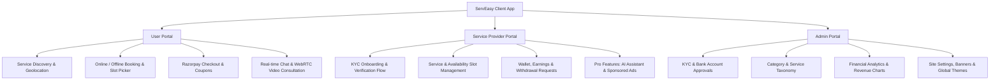

# ServEasy —(Frontend)

[](https://react.dev/)
[](https://www.typescriptlang.org/)
[](https://vitejs.dev/)
[](https://tailwindcss.com/)
[](https://daisyui.com/)
[](https://redux-toolkit.js.org/)
[](https://socket.io/)
[](https://webrtc.org/)

**ServEasy** is a full-featured on-demand service marketplace and real-time consultation platform. It connects customers with verified professionals for both in-person (offline) tasks and remote (online) video consultations, complete with live chat, automated scheduling, coupon discounts, secure payment workflows, dynamic theme customization, and an administrative oversight panel.

---

## 📑 Table of Contents

- [Overview & Architecture](#-overview--architecture)
- [Key Features by Role](#-key-features-by-role)
  - [1. User / Client Portal](#1-user--client-portal)
  - [2. Service Provider Portal](#2-service-provider-portal)
  - [3. Admin Management Portal](#3-admin-management-portal)
- [Technical Architecture & State Management](#-technical-architecture--state-management)
- [Technology Stack](#-technology-stack)
- [Project Structure](#-project-structure)
- [Environment Configuration](#-environment-configuration)
- [Getting Started & Local Setup](#-getting-started--local-setup)
- [Available Scripts](#-available-scripts)

---

## 🔭 Overview & Architecture

ServEasy is designed as a high-performance single-page application (SPA) that delivers dedicated experiences for three primary user personas:



---

##  Key Features by Role

### 1. User / Client Portal
- **Discovery & Search**:
  - Keyword search, category-based filtering, and real-time location autocompletion.
  - Interactive service details pages featuring provider ratings, customer reviews, pricing, and visual work portfolios.
- **Flexible Booking Workflows**:
  - **In-Person (Offline) Services**: Multi-address management with geolocation detection, slot selection, and booking confirmations.
  - **Remote (Online) Consultations**: Real-time slot reservation for virtual appointments.
- **Payment & Checkout**:
  - **Razorpay Payment Gateway integration** supporting instant checkout, signature verification, and automated retry handling.
  - **Coupon System**: Discover, copy, and apply active discount codes with instant cart validation.
  - **PDF Invoices & Bills**: Client-side bill viewing and PDF receipt generation (`jspdf`, `html-to-image`).
- **Real-Time Communication**:
  - **Socket.io Chat**: Instant messaging, image attachment sharing, emoji picker (`emoji-picker-react`), unread badges, and presence indicators (online/offline/last seen).
  - **WebRTC Video Calls**: Peer-to-peer 1-on-1 video consultations with Google STUN servers, device permission guards, incoming call modal, and custom audio ringtones.
- **Account & Personalization**:
  - Profile updates with OTP verification.
  - Appearance settings with **26+ DaisyUI themes** dynamically persisted in `localStorage`.

---

### 2. Service Provider Portal
- **Onboarding & Verification (KYC)**:
  - Step-by-step registration with identity document uploads and bank account details (account number, IFSC code).
  - Real-time review status tracker (`pending`, `verified`, `rejected` with reapplication flow).
- **Service & Availability Management**:
  - Create and manage service listings with images, descriptions, pricing, and categories.
  - Bulk activation/deactivation of services.
  - Time-slot configurator for scheduling available dates and hours.
- **Booking & Order Fulfillment**:
  - Manage incoming requests across distinct lifecycle states: `Pending`, `Confirmed`, `In Progress`, `Completed`, `Cancelled`.
  - Offline appointment verification and completion workflows.
- **Finance & Digital Wallet**:
  - Earnings tracking, transaction histories, and withdrawal request submissions.
  - Visual earnings summary and downloadable PDF reports.
- **Pro Tier Subscription Features** *(Route-Guarded)*:
  - **AI Assistant**: Multi-session conversational AI interface with Markdown rendering (`react-markdown`, `remark-gfm`, `rehype-highlight`) to help providers draft service descriptions and respond to inquiries.
  - **Sponsored Ads Manager**: Create and launch promotional banners with customizable duration and placement budgets.

---

### 3. Admin Management Portal
- **Dedicated Authentication**:
  - Separate administrative login with secure token isolation (`adminToken`) and auto-refresh interceptors.
- **Dashboard & Financial Visualizations**:
  - Interactive Recharts dashboards for revenue breakdown, convenience fees, and date-range filtered transaction tables.
- **Verification & Moderation**:
  - Review provider KYC documents and bank details with approve/reject reason modals.
  - User and service provider listing controls (block / unblock).
- **Marketplace Management**:
  - Category and service taxonomy management (add/edit/remove categories and sub-services).
  - Centralized booking oversight across all providers.
  - **Coupon Engine**: Create discount campaigns with percentage or fixed deductions, minimum spend constraints, and expiry dates.
  - **Subscription Plan Builder**: Create and edit Pro tier subscription tiers for providers.
  - **Sponsored Ad Approval**: Moderate provider-submitted promotional campaigns.
  - **Wallet Oversight**: Review and process provider withdrawal requests.
  - **Site Settings & CMS**: Update home banners, footer promotional banners, and default site themes.
  - **Audit & System Logs**: Inspect application-level event logs.

---

## 🛠 Technical Architecture & State Management

### 1. Dual-Scope Axios Interceptors (`AxiosInstance.ts` & `AxiosAdmin.ts`)
- Automated JWT Bearer token injection for client and admin requests.
- **Silent Token Refresh**: Automatic `401 Unauthorized` interception that requests a new access token from `/refresh-token` or `/admin-refresh-token` without disrupting the user experience.
- **Account Block Handling**: Automatic `403 Forbidden` detection that logs out blocked accounts and redirects with explanatory status messages.

### 2. Centralized Redux Store (`@reduxjs/toolkit`)
- `userSlice`: Stores authenticated user profile, verification status, and active services.
- `serviceProviderSlice`: Manages provider profile, KYC status, bank credentials, active services, and Pro status.
- `adminSlice`: Stores admin profile, registered providers, customer lists, and system services.
- `subscriptionModalSlice`: Controls subscription upgrade modal visibility.

### 3. Real-Time Layer (`socket.ts` & Custom Hooks)
- Singleton WebSocket connection managed via `socket.io-client`.
- Event listeners for instant incoming notifications, message deliveries, presence status, and WebRTC signaling exchange (`offer`, `answer`, `ice-candidate`).
- Audio chime triggers for new messages, notifications, and video calls.

---

## 💻 Technology Stack

| Category | Technology / Library |
| :--- | :--- |
| **Core Framework** | React 18.3, TypeScript 5.7, Vite 6.1 |
| **Routing** | React Router v7 |
| **State Management** | Redux Toolkit, React-Redux |
| **Styling & Design** | Tailwind CSS 3.4, DaisyUI 4.12 (26 themes) |
| **Icons & Media** | Lucide React, FontAwesome, Day.js |
| **Real-Time & Media** | Socket.io Client 4.8, WebRTC (Browser API) |
| **Data Visualization** | Recharts 2.15 |
| **Payments** | Razorpay SDK |
| **Authentication** | Google OAuth 2.0 (`@react-oauth/google`), JWT |
| **Document Generation** | jsPDF 3.0, html-to-image, html2canvas |
| **Rich Text & Markdown** | React Markdown, Rehype Highlight, Remark GFM |
| **Notifications** | React Hot Toast, React Toastify |
| **Code Quality & Build** | ESLint 9, Terser (console/debugger stripping) |

---

## 📂 Project Structure

```text
servEasy-frontEnd/
├── public/                     # Static media, audio ringtones, and notification sounds
├── src/
│   ├── assets/                 # Static graphical assets (animations, placeholders)
│   ├── components/             # Reusable & feature-specific components
│   │   ├── Address/            # Address creation, editing, and selection cards
│   │   ├── Chart/              # Recharts analytics, stats, and payment tables
│   │   ├── ServiceProvider/    # Provider onboarding, slot management, ads, AI assistant
│   │   ├── User/               # User navigation, home search, chat, profile views
│   │   ├── VideoCall/          # WebRTC video room UI and call controls
│   │   ├── admin/              # Admin auth, coupons, subscriptions, site settings, wallets
│   │   └── ui/                 # Shared UI primitives (buttons, modals, cards, skeletons)
│   ├── hooks/                  # Custom React hooks (useAuth, useVideoCall, useNotifications, useTheme)
│   ├── layouts/                # Base layouts for User, Service Provider, and Admin
│   ├── pages/                  # Page-level route views
│   │   ├── admin/              # Dashboard, Users, Providers, Bookings, Ads, Coupons, Settings
│   │   ├── serviceProvider/    # Dashboard, Services, Slots, Bookings, Chats, Wallet, AI Assistance
│   │   └── user/               # Landing, Home, Service Details, Booking, Chats, Video Call, Profile
│   ├── redux/                  # Redux Toolkit store and slices (user, serviceProvider, admin, modal)
│   ├── routes/                 # Route declarations (UserRoutes, ServiceProviderRoutes, AdminRoutes)
│   ├── utils/                  # Axios instances, Socket client, constants, DTOs, interfaces
│   ├── App.tsx                 # Root application component and route mount
│   ├── main.tsx                # Entry point with Google OAuth and Redux Provider
│   └── index.css               # Global Tailwind CSS directives and custom utility classes
├── index.html                  # HTML template
├── tailwind.config.js          # Tailwind & DaisyUI configuration
├── tsconfig.json               # TypeScript compiler configuration
├── vite.config.ts              # Vite bundler configuration
└── package.json                # Project dependencies and npm scripts
```

---

## ⚙️ Environment Configuration

Create a `.env` file in the root directory and define the following variables:

```env
# Backend API & WebSocket Server URL
VITE_BACKEND_URL=http://localhost:5000

# Google OAuth 2.0 Client ID (from Google Cloud Console)
VITE_GOOGLE_CLIENT_ID=your_google_oauth_client_id.apps.googleusercontent.com

# Razorpay Key ID (from Razorpay Dashboard)
VITE_RAZORPAY_KEY_ID=rzp_test_your_razorpay_key_id
```

---

##  Getting Started & Local Setup

### Prerequisites
- **Node.js**: `v18.x` or higher (recommended: `v20.x+`)
- **npm** or **yarn** / **pnpm**
- Running instance of the ServEasy Backend Server

### Installation Steps

1. **Clone the repository**:
   ```bash
   git clone https://github.com/AbhiramThaiparambil/servEasy-frontEnd.git
   cd servEasy-frontEnd
   ```

2. **Install dependencies**:
   ```bash
   npm install
   ```

3. **Configure environment variables**:
   Create a `.env` file in the root directory as shown in the [Environment Configuration](#-environment-configuration) section.

4. **Start the local development server**:
   ```bash
   npm run dev
   ```
   The application will be accessible at `http://localhost:5173` (or the port assigned by Vite).

---

## 📜 Available Scripts

- `npm run dev` — Starts the Vite development server with Hot Module Replacement (HMR).
- `npm run build` — Runs TypeScript type-checks (`tsc -b`) and produces an optimized production build in `dist/`.
- `npm run preview` — Locally previews the production build.
- `npm run lint` — Runs ESLint to check for code quality and style issues.

---

## 👨‍💻 Author

**Abhiram TB**  
Full Stack Developer   
- GitHub: [@AbhiramTB](https://github.com/AbhiramTB)

